# How the NVDA escalation probe is trained today

*NemotronLabs-VoiceChat-11B · escalation-gate paper, second duplex family · 2026-09-01*

Every number here is recomputed from the checked-in replay data under
`interactive_paper/data/gate_pull/` by `make_figs.py` (CPU, ~40 s), or cited
from `RESULTS.md` where noted.

## 0. One-paragraph summary

The probe is a **single L2-regularised logistic regression** on **standardised
hidden-state features** of the frozen VoiceChat model, read at the model's own
**commit-to-speak moment**. Features = three 4,480-d vectors from layer 30
(the last frame of an 8-frame window starting at the commit frame, the mean of
that window, and the mean over all user-audio frames) → 13,440 dims. It is fit
on 2,481 English calibration queries labelled fail/pass by a GPT judge, with
5-fold out-of-fold (OOF) AUC .820. Frozen and applied cold to four external
speech-QA pools it reaches AUC .838 / .851 / .771 / .774 (mean .808). A second
identical head on the same features separates questions from floor-management
utterances ("stop", backchannels) so those never escalate. Thresholds are OOF
score quantiles at 15 / 30 / 50 % escalation budgets.

```mermaid
flowchart LR
  A[query wav<br/>2,550 calib + 950 external] --> B[NeMo offline voicechat<br/>cacheless, bf16, batch ≤8<br/>~4.3 s/query]
  B --> C[agent text → judge<br/>gpt-5.4-mini vs reference<br/>escalate_label ∈ {0,1}]
  B --> D[forward hooks on 14 layers<br/>H_eot, H_onset, H_mean<br/>fp16 npz shards]
  D --> E[features @L30<br/>onset_last ‖ onset_mean8 ‖ user_mean<br/>3×4480 = 13,440-d]
  C --> F
  E --> F[StandardScaler → LogisticRegression C=1e-4<br/>5-fold OOF on calib]
  F --> G[OOF scores → tier thresholds<br/>15 / 30 / 50 % quantiles]
  F --> H[cold external AUC<br/>striviaqa swebq sllama sdqa]
  F --> I[gate_demo_nvda.json<br/>raw-space w,b + act head]
```

## 1. Data

### 1.1 Calibration set (2,550 → 2,481 rows)

Three query files, all English, TTS'd once and replayed through the model:

| file | ids | pools | rows | committed |
|---|---|---|---|---|
| `queries.jsonl` ("frozen") | q0000… | easy-chat, easy-fact, hard-knowledge, hard-math, trap (360 `calib` + 240 `test`) | 600 | 560 |
| `queries_expansion.jsonl` | x0000… | easy-chat, easy-fact, hard-math, know-arc, know-open, trap | 800 | 791 |
| `queries_expansion2.jsonl` | y0000… | easy-mathword, hard-multihop, know-commonsense, know-longtail, know-mmlu, know-openbook, trap-truthful | 1,150 | 1,130 |

69 queries never produce a commit frame (see §2.2) and are dropped from every
fit. Overall fail rate .717; per-pool fail rates range .27 (know-arc) to 1.00
(frozen trap).

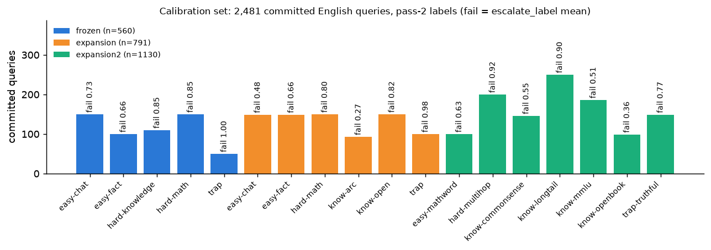

Two fits use different subsets of this:
- **Full cohort (n=2,481)** — the layer sweeps, hill-climb, external transfer.
- **Demo artifact (n=2,258)** — `fit_demo_artifacts.py` excludes the 240
  frozen `test` rows (they are the paper's internal test set) → nominal 2,310,
  52 no-commit dropped.

### 1.2 External pools (cold, never used in fitting)

striviaqa 250, swebq 250, sllama 250 (OpenAudioBench), sdqa 200 (VoiceBench
SD-QA, `usa` split), valpaca 199 (AlpacaEval, VoiceBench 1–5 score — no binary
label, not in the AUC table). Audio rebuilt from the public sources with the
repo's own staging code (seed 42); striviaqa/swebq byte-identical to the
owner's copies. Labels: `onset/nvda_*_ext2.parquet`.

### 1.3 Labels

`escalate_label` = 1 if the judge (`escalate.judge_many`, gpt-5.4-mini)
marks the model's agent-channel transcript wrong against the reference answer.
The transcript is the text the duplex model itself emits — no ASR.

Replay is not deterministic: bf16 + length-bucketed batching changes the
**answer text** for 383/2,550 calibration queries (15 %) and 6–12 % of external
queries between the two passes on disk. Only changed answers are re-judged; the
resulting **label flips are 34/2,550 (1.3 %)** calibration and 0.4–1.6 %
external. A 2-pass fractional-label fit moves OOF AUC by +.0001. Judge
variance on identical text has not been measured for NVDA.

## 2. Capture: what is read, and when

### 2.1 Inference path and hooks

`nvda_replay.py` (a verbatim port of `modal_nvda.py::answer_shard`) drives
NVIDIA's official NeMo `offline_voicechat` path. The path is **cacheless**: each
80 ms frame re-runs the full prefix, so the final frame's forward contains
every position and one hook capture per layer yields all read points. Forward
hooks on `stt_model.llm.layers[L]` for **L ∈ {2, 6, 10, …, 54}** (14 of 56
NemotronH blocks: 27 Mamba-2 / 4 attention / 25 MLP) store the residual
stream. A 12 s silent tail is appended to every wav so the model has room to
answer. System prompt: "answer directly and concisely; do not greet."

### 2.2 The commit frame

The agent text channel emits one token per frame: PAD (id 12) while listening,
real tokens while speaking. **Commit frame** = start of the first run of ≥3
consecutive non-PAD tokens (single-frame marker tokens such as `<$t$>` are
ignored). This is the model's own listen→speak decision — no VAD, no ASR, no
turn template.

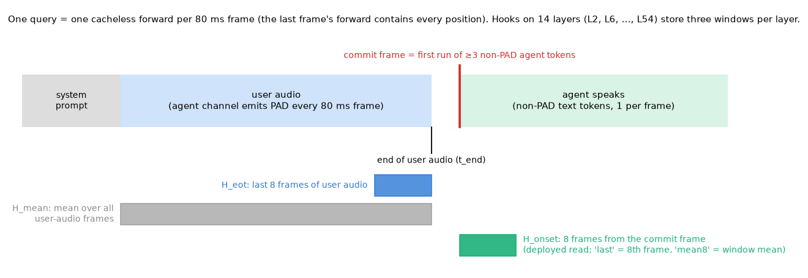

Three fp16 windows are stored per layer per query (`K_EOT = 8`):

| array | shape | content |
|---|---|---|
| `H_eot` | (14, 8, 4480) | last 8 frames of user audio, positions `[t_end−8, t_end)` |
| `H_onset` | (14, 8, 4480) | 8 frames starting at the commit frame (zero-padded if fewer) |
| `H_mean` | (14, 4480) | mean over all user-audio positions `[prompt_len, t_end)` |

Per-position states outside these windows are **not** stored.

The commit lands a median **+0.24 s after** the user audio ends; 44 % of
queries commit *before* the audio ends (the model starts answering early),
89 % within ±1 s; 69/2,550 never commit.

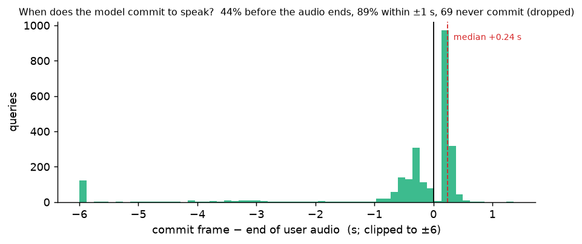

The cluster at −6 s (196 rows, 7.9 % of the committed 2,481, mostly hard-math / hard-knowledge
with long audio) is genuine barge-in: the raw transcripts start with real
answer text (e.g. "Since chickens have two legs and cows have four …", "What
would you like to know") while the user is still talking, not marker tokens.
Their fail rate is .66 vs .72 for the rest; dropping them changes the
deployed probe by <.001 (OOF .8206, external .808). For these rows the onset
window sits mid-user-utterance and `H_mean` / `H_eot` include frames the
model heard *after* committing.

## 3. Features and fit

### 3.1 Deployed recipe (onset read @ L30)

```python
# fit_demo_artifacts.py / score_ext.py (verbatim logic)
J30 = LAYERS.index(30)
def stack(E, M):                        # E = H_onset, M = H_mean, fp32
    return np.concatenate([E[:, J30, -1],       # onset_last : 8th frame after commit
                           E[:, J30].mean(1),   # onset_mean8: mean of the 8-frame window
                           M[:, J30]],          # user_mean  : mean over user-audio frames
                          axis=1)               # → 13,440 dims

clf = make_pipeline(StandardScaler(),
                    LogisticRegression(C=1e-4, max_iter=5000))
oof = cross_val_predict(clf, X, y, cv=StratifiedKFold(5, shuffle=True, random_state=42),
                        method="predict_proba")[:, 1]
```

- **Standardisation** is per-feature z-scoring on the training fold. It is
  worth +.015–.023 AUC at every C in the hill-climb.
- **C = 1e-4** is very strong L2 (sklearn's C is the inverse penalty; 13,440
  features, ~2,000 training rows per fold). The C sweep is monotone: 1e-4
  .820 > 3e-4 .816 > 1e-3 .805 > 3e-3 .795 > 1e-2 .787.
- No class weighting, no feature selection, no PCA, no calibration layer.
- Same recipe on every model in the paper (MiniCPM "8ac recipe"), so
  cross-family rows are comparable.

### 3.2 Thresholds

Tier thresholds are quantiles of the calibration OOF scores:
conservative = 85th pct (15 % escalate), balanced = 70th, aggressive = 50th.
Demo artifact (n=2,258): .918 / .867 / .767. Thresholds are refit per regime
and never transferred (MiniCPM showed fire-rate drift of 14–23 points on
external pools when they were).

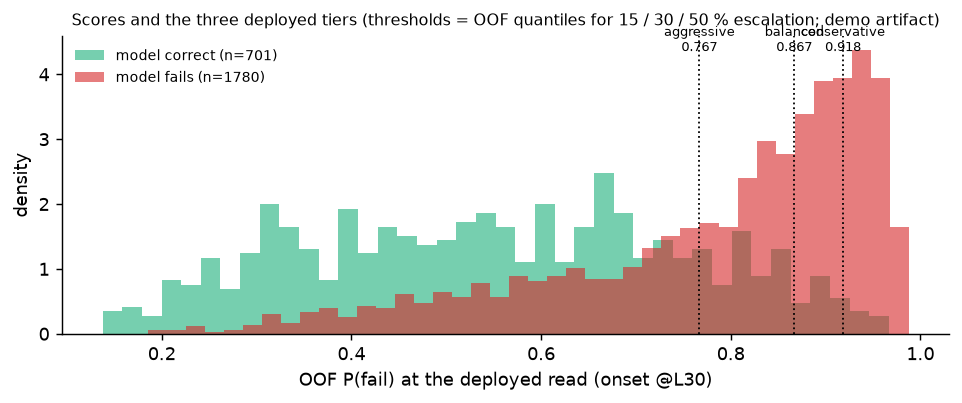

### 3.3 The act head (dialogue-act gate)

A second `StandardScaler → LogisticRegression(C=1e-4)` on the **same L30
stack**, trained on the 2,258 calibration questions (positive) vs 196 TTS'd
floor-management stims (stop / backchannel / ack / filler, en+zh, 2 voices;
negative). OOF AUC .9999. τ = 0.5th percentile of the question-side OOF
scores (.924): passes 0 % of stims under leave-one-pool-out, costs 0.73 % of
true escalations. Gate fires iff `act ≥ τ ∧ P(fail) ≥ tier`. Without it, the
failure probe false-fires on 9 / 69 / 100 % of stims at the three tiers.

### 3.4 Export

`fit_demo_artifacts.py` folds the scaler into the weights
(`w = coef / scale`, `b = intercept − Σ w·mean`) and writes
`gate_demo_nvda.json` (`fail.w/b/thresholds`, `act.w/b/tau`, `layer=30`,
`k_eot=8`). `src/nvda_duplex_probe.py` reproduces the commit state machine
online: accumulate PAD-frame hiddens for `user_mean`, detect the ≥3-run,
collect 8 onset frames, then score once. The decision therefore lands
**8 frames (640 ms) after the commit frame**, i.e. the probe reads the
model's first ~7 answer tokens, not only its pre-answer state (see §9.1).

**Train/serve skew in `user_mean` (both reviewers, confirmed by reading the
code).** Offline `H_mean` averages `[prompt_len, t_end)`. The online class
averages *all PAD frames before commit*: for the 56 % of queries that commit
after `t_end` this adds silent-tail frames; for the 44 % that commit early it
drops the frames between commit and `t_end`. The current turn-level demo
uses the offline capture path, so it is unaffected; the streaming port must
either redefine `user_mean` as "mean over frames before commit" *and*
re-capture calibration with that definition, or drop `user_mean` (−.004
AUC).

## 4. How the recipe was chosen

### 4.1 Layer sweep (single "last" feature)

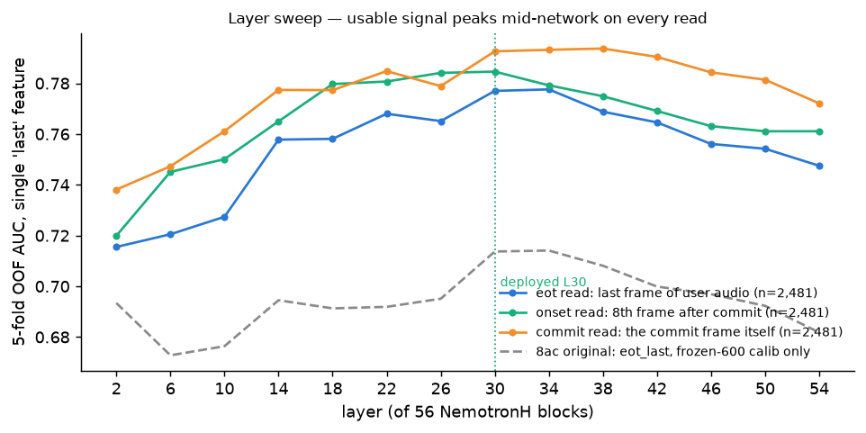

Every read peaks mid-network (L22–L38, ~40–68 % depth) and falls off toward
the output. The onset curve is flat within .005 from L18 to L34. Deployed
layer L30 was picked as the onset-read argmax (.785 single feature). The 8ac
original (600-row calib, dashed) had the same shape at a lower level — the
calibration expansion lifted the whole curve.

### 4.2 Feature stacking

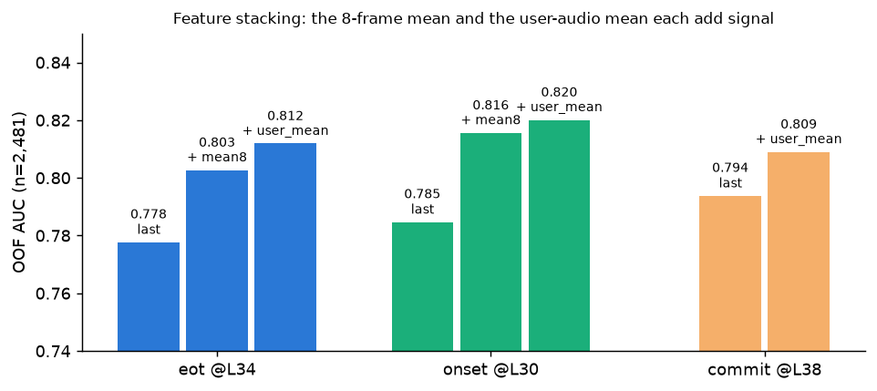

| read | last | + mean8 | + user_mean | external mean |
|---|---|---|---|---|
| eot @L34 (`H_eot`) | .778 | .803 | **.812** | .781 |
| onset @L30 (`H_onset`) — deployed | .785 | .816 | **.820** | **.808** |
| commit @L38 (commit frame itself) | .794 | — | .809 (+user_mean only) | — |

The pre-registered expectation eot ≥ onset was **not** confirmed; all three
reads are within .011 (sampling SE of an AUC at n=2,481 is ≈.009; CV-seed
jitter is only .0004), so the deployed read costs nothing. Chronology, for
the cold-transfer claim: the onset@L30 read was fixed from these
calibration sweeps (`sweep_onset.json` written 2026-09-01 00:51) before any
external pool was scored at the onset read (external onset shards and
`_ext2` labels written 15:13–15:14).

### 4.3 Hill-climb (18 variants, OOF, n=2,481)

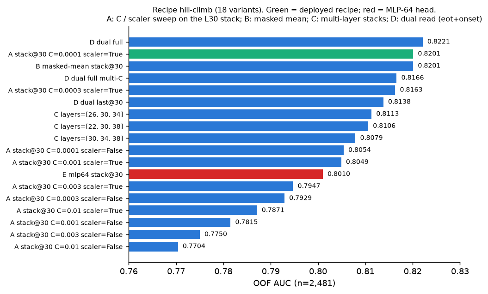

Range .770–.822. Best "dual read, all features" (eot+onset stacks) = .822,
+.002 over the deployed recipe (noise). A 64-unit MLP head is *worse* (.801).
Three-layer stacks (.808–.811) are worse than L30 alone. **The recipe is at
ceiling on this calibration data; data is the lever** (600→2,550 rows moved
external mean .757→.782 at the eot read, ≈+.013 AUC per 1k rows; two-point
slope).

### 4.4 Strict mirror of the MiniCPM protocol

Refit with the frozen `calib`-360 discipline (test-240 excluded, n=2,258):
eot .800 / onset .814, winner masked-mean L26, C=3e-4 — the asterisk-free rows
for the cross-family table (`onset/strict_refit.json`).

## 5. Evaluation

### 5.1 Cold external transfer

Probe fit on the full 2,481-row cohort, externals scored once with their own
pass-2 labels (`score_ext.py`; `ext_transfer_by_read.json`):

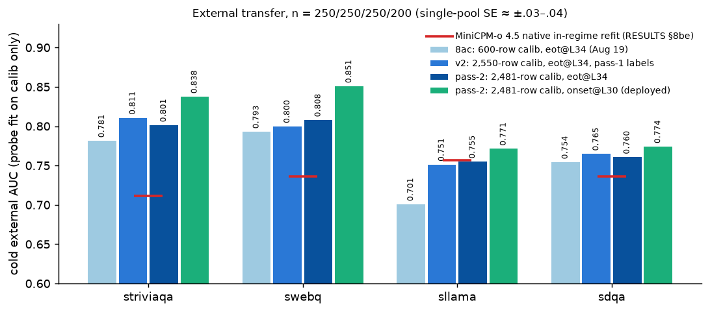

| probe | striviaqa | swebq | sllama | sdqa | mean |
|---|---|---|---|---|---|
| 8ac original: 600-row calib, eot@L34 | .781 | .793 | .701 | .754 | .757 |
| v2: 2,550-row, eot@L34, pass-1 labels | .811 | .800 | .751 | .765 | .782 |
| pass-2: 2,481-row, eot@L34 | .801 | .808 | .755 | .761 | .781 |
| **pass-2: 2,481-row, onset@L30 (deployed)** | **.838** | **.851** | **.771** | **.774** | **.808** |
| MiniCPM-o 4.5 native in-regime refit (RESULTS §8be) | .711 | .736 | .757 | .736 | .735 (En-4) |

Single-pool SE at n=200–250 is ≈ ±.03–.04, so per-pool differences between
rows are mostly inside noise; the four-pool mean is the number to read.

### 5.2 What the gate buys (re-mix, owner's analysis)

Offline re-mix with official judges (appendix `tab:nvda-remix`) shows
selective escalation beating matched-rate random on all five pools
(p ≤ .0004 at 30/50 % budgets). Note this used the **8ac-era 600-row eot
probe**, not the current onset@L30 probe; it has not been redone.

## 6. Known weaknesses (diagnostics on the current probe)

1. **Pooled AUC ≠ within-pool AUC.** On the same OOF scores, within-pool
   AUC is .60–.88 (easy-chat .88, know-open .87, easy-mathword .80,
   know-longtail .77, easy-fact .72, hard-math .72, trap-truthful .68,
   hard-knowledge .68, know-arc .67, know-mmlu .64, hard-multihop .63,
   know-openbook .63, know-commonsense .60; `trap` is degenerate — 2
   negatives — and excluded; values from `doc_numbers.json`, seed 42).
   A score that outputs only the pool's fail rate reaches AUC **.752** on
   the calibration set, so the .820 is +.068 over pool identity; the mean
   within-pool AUC is .713 (OOF) and .687 under leave-one-pool-out. The
   MCQ-style knowledge pools (arc, mmlu, openbook, commonsense) are the
   weakest *and* the most balanced.

   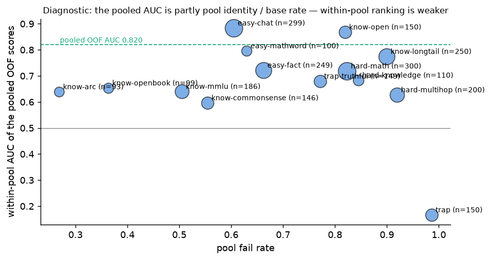

2. **Very strong regularisation, huge feature space.** 13,440 dims, C=1e-4,
   ~2,000 rows/fold. The C curve is monotone toward *more* regularisation,
   which suggests the probe is variance-limited, not bias-limited.
3. **Three windows only.** No per-frame trajectory, no layers between the
   every-4th grid, no sub-block (Mamba mixer vs attention) reads.
4. **The "last" feature is commit+7 frames**, not the commit frame. The
   strictly-at-commit read (`commit_last`) is .794 single-feature / .809 with
   `user_mean`; it has not been tried inside the full stack.
5. **Label noise is small (1.3 %) but judge variance is unmeasured**; the
   fail rate is .72, so positives dominate.
6. **English-only, one TTS voice per query, one acoustic condition.** No
   accent / noise robustness check yet (SD-QA ships 11 human dialect splits).
7. **Thresholds are fragile across pools.** Measured for the first time on
   NVDA (v2 probe, calibration thresholds for nominal 15/30/50 %):
   striviaqa fires 2/16/50 %, swebq 6/20/46 %, **sllama 1/4/12 %**, sdqa
   8/34/59 %. Easy pools under-fire badly; the conservative tier barely
   fires anywhere. Thresholds must be set per deployment regime and, ideally,
   per expected difficulty.
8. **Calibration ≠ deployment regime**: offline replay, batch ≤8, bf16.
   Live streaming port is scoped but not built.

## 7. Files

| what | where |
|---|---|
| capture | `gate_pull/new/demo/nvda_replay.py` |
| calib shards (pass 2, dual read) | `gate_pull/onset/nvda_h_{frozen,expansion,expansion2}.shard*.npz` |
| calib labels (pass 2) | `gate_pull/onset_fit/nvda_{frozen,expansion,expansion2}.parquet` |
| external shards, L22–38 slice | `gate_pull/onset_ext/nvda_h_*.L22-38.npz` (full 14-layer shards are not tracked) |
| external labels | `gate_pull/onset/nvda_*_ext2.parquet` |
| sweeps / hill-climb / strict refit | `gate_pull/onset/sweep_{eot,onset,commit}.json`, `hillclimb.json`, `strict_refit.json` |
| external transfer | `probe_doc/scripts/score_ext.py` |
| demo fit + export | `gate_pull/new/demo/fit_demo_artifacts.py` → `gate_demo_nvda.json` |
| online readout | `interactive_paper/src/nvda_duplex_probe.py` (+ `tests/`) |
| act analysis | `probe_doc/scripts/act_analysis.py`, `gate_pull/onset/act_analysis.json` |
| this doc's figures | `probe_doc/make_figs.py` → `probe_doc/figs/`, numbers in `doc_numbers.json`; `make_fig_round.py` → fig 10 |
| local harness | `probe_doc/probe_lab.py` (loaders, deployed recipe, OOF / LOPO / external) |
| review round | `probe_doc/review_fable51.md`, `review_gpt56.md`; `experiments.py`, `experiments2.py`, `experiments3.py`, `compare.py` → `results_batch{1,2,3}.json`, `results_round{2,3}.json`, `compare.json`, `all_variants_ranked.json` |
| improved probe v2 | `probe_doc/export_probe_v2.py` → `probe_doc/gate_demo_nvda_v2.json` |
| gate-benefit re-mix | `probe_doc/remix_eval.py` → `remix_eval.json`; `make_fig_remix.py` → fig 11 |
| causal re-capture (pass 3) | `gate_pull/new/demo/nvda_replay_v2.py`; full 14-layer shards are not tracked (12 GB); L22–38 slices `gate_pull/onset3/`; `experiments4.py` → `results_round4.json`; `make_fig_round4.py` → fig 12 |

Reproduce the figures:

```bash
cd interactive_paper/data/gate_pull/new/probe_doc
uv run --with numpy --with pandas --with pyarrow --with scikit-learn --with matplotlib python make_figs.py
```

## 8. Constraints any change must respect

1. Frozen model — no fine-tuning of VoiceChat.
2. Native duplex protocol only — no ASR front-end, no turn-based template, no
   harness that fakes duplex behaviour.
3. The read happens at the model's own commit-to-speak moment (or earlier).
4. Thresholds are recalibrated per regime; offline-replay regime disclosed.
5. Linear (or trivially small) head, so "zero-training gate on frozen hidden
   states" stays true.
6. External pools stay cold: fit on calibration only; never select on them.

## 9. Review round (2026-09-01): two model reviewers, ≈85 variants, one small win

Sections 0–8 were handed to two independent reviewers (Claude Fable 5.1 →
`review_fable51.md`; GPT-5.6 → `review_gpt56.md`; both verbatim, both ran
their own quick fits on `probe_lab.py`). Their proposals were then run in a
common harness with a **pre-declared selection rule: rank by
leave-one-pool-out (LOPO) metrics on calibration only; external AUC is
reported for every variant but never used to select** (`experiments.py`,
`experiments2.py`, `experiments3.py`; results in `results_*.json`).

### 9.1 What the reviewers agreed on

- **The headline OOF is mostly pool identity** (pool-fail-rate oracle .752;
  within-pool mean .713; LOPO within-held-pool mean .687). Report those next
  to the pooled number. Projecting out 1–2 pool-centroid directions drops
  pooled OOF .824→.780 while external stays .815–.817 — the transfer signal
  does not depend on the shortcut, but the pooled number does.
- **The deployed read is not pre-answer.** Per-frame sweep (Fable): external
  AUC rises monotonically from frame 0 (.779) to frame 7 (.797) of the onset
  window. The probe partly reads the model's own first 560 ms of answer. A
  strictly-at-commit read (commit frame + user mean) costs **≈.03 external
  AUC** (.778 vs .808, best at L34) — that is the price of a fully causal
  gate, now measured. The paper should say "reads the first 8 frames of the
  answer" rather than "predicts before answering".
- **`user_mean` train/serve skew** for the streaming port (§3.4).
- **Pooled LOPO is inflated** by cross-pool score offsets; the honest
  transfer proxy is the mean of within-held-pool AUCs (used below as
  `lopoM`; .687 for the deployed probe with the ≥10-per-class pool rule —
  GPT's own run reported .658 under a different eligible-pool rule).
- **Label noise is not the ceiling** (1.3 % flips; 2-pass soft labels
  +.0001). **Data scaling is concave**: 25/50/75/100 % of calibration →
  external .778/.793/.800/.808 (Fable's learning curve).
- Both said: no MLP, no PCA/whitening, no aggressive re-weighting, no
  selecting on the external pools. All confirmed below.

### 9.2 What was tried (≈85 variants; representative rows)

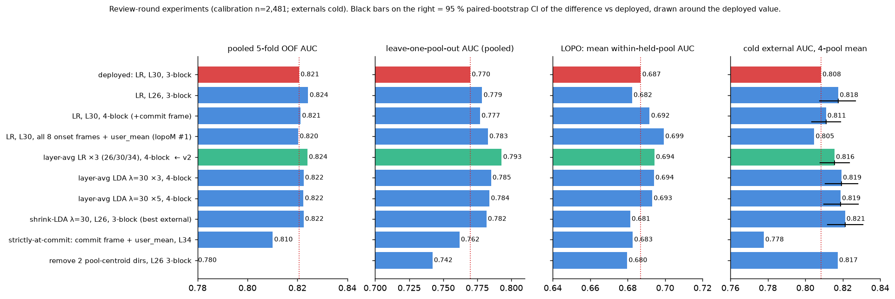

| variant | OOF | LOPO | lopoM | ext mean | Δext vs deployed (paired 95 % CI) |
|---|---|---|---|---|---|
| **deployed**: LR C=1e-4, L30, 3-block | .821 | .770 | .687 | .808 | — |
| LR, L26, 3-block | .824 | .779 | .682 | .818 | +.009 [−.001, +.018] |
| LR, L30, 4-block (+ commit frame) | .821 | .777 | .692 | .811 | +.003 [−.005, +.011] |
| LR, L30, all 8 onset frames + user_mean (40k dims) | .820 | .783 | **.699** | .805 | −.004 |
| **v2: layer-avg LR ×3 (L26/30/34), 4-block** | **.824** | **.793** | .694 | .816 | +.007 [−.000, +.015] |
| layer-avg LR ×5 (L22–38), 4-block | .824 | .792 | .695 | .815 | +.007 [−.002, +.015] |
| layer-avg shrink-LDA λ=30 ×3, 4-block | .822 | .785 | .694 | .819 | +.011 [+.002, +.020] |
| layer-avg shrink-LDA λ=30 ×5, 4-block (Fable's combo) | .822 | .784 | .693 | .819 | +.010 [+.002, +.020] |
| shrink-LDA λ=30, L26, 3-block | .823 | .782 | .681 | **.821** | **+.013 [+.004, +.022]** |
| shrink-LDA λ=30, L30, 3-block (λ by OOF) | .818 | .774 | .686 | .811 | +.003 [−.001, +.007] |
| strictly-at-commit: commit frame + user_mean, L34 (best by LOPO) | .810 | .762 | .683 | .778 | −.031 |
| remove 2 pool-centroid directions, L26 | .780 | .742 | .680 | .817 | +.009 |
| L30: C ∈ {3e-5, 3e-4}, robust scaler, ridge, class weights | ≤ .820 | ≤ .771 | ≤ .686 | ≤ .809 | −.010 … +.001 (C=1e-5: −.027) |
| L26: winsorised 1 % / clipped / robust scaling | ≤ .824 | ≤ .778 | ≤ .684 | ≤ .818 | ≤ +.010 (= L26 LR baseline) |
| pool+class-balanced weights (full), L30 | .787 | .765 | .677 | .773 | −.035 |
| PCA-64…512 (+whiten) → LR; PLS 4–32; shrink-LDA on PCA | ≤ .817 | ≤ .772 | ≤ .671 | ≤ .812 | ≤ +.004 (PLS-4); mostly < 0 |
| L30 frame variants: differences, early/late halves, commit-as-last | ≤ .824 | ≤ .776 | ≤ .694 | ≤ .809 | ≈ 0 |
| dual read onset+eot (concat or logit-avg) | ≤ .822 | ≤ .774 | ≤ .695 | ≤ .807 | ≤ 0 |
| 3-read logit-avg onset@30 + eot@34 + commit@38 (Fable's run) | .820 | .769 | — | .800 | −.008 |
| L26 LR, drop the 34 pass-flipped labels from training | .823 | .778 | — | .820 | +.012 vs deployed; +.003 vs L26 LR |

`lopoM` = mean within-held-pool AUC over the 13 eligible pools (≥10 of each
class; `trap` excluded). OOF: round-3 lettered rows are the mean over 3 CV
seeds (seed SD ≤ .002); all other rows are a single seed (42). Δext CIs:
2,000 paired bootstrap resamples of the same external queries, stratified by
pool; rows without a CI were not bootstrapped. Full ranking of all 88
variant names: `all_variants_ranked.json`.

### 9.3 The improved probe (v2) and what it is worth

**v2 = average of three per-layer linear heads (L26, L30, L34), each
`StandardScaler → LogisticRegression(C=1e-4)` on the 4-block onset stack
`[commit frame | 8th frame | 8-frame mean | user-audio mean]`, logits
standardised per head before averaging.** It is still one linear function of
frozen hidden states (constraint 5). On the pre-declared calibration-only
rule it is the only variant that improves *every* calibration metric at once
(lopoM .694 vs .687, LOPO .793 vs .770 — the best pooled LOPO of all
variants — OOF .824 vs .821), and it was chosen over the ×5 version for
needing three hooks instead of five. Two honesty notes. (i) Ranked by lopoM
alone, four variants sit within .005 of each other at the top
(all-8-frames@L30 .699, layer-avg ×5 .695, dual-read logit-avg .695, v2
.694); the lopoM #1, all-8-frames@L30, does **not** transfer better
(external −.004), so lopoM cannot discriminate at this resolution and the
choice of v2 among that group is a judgment call. (ii) v2's external gain,
+.007 [−.000, +.015], is real-looking but small; the largest external gain
in the whole grid is shrink-LDA λ=30 at L26 on the 3-block stack, +.013
[+.004, +.022], but its lopoM (.681) is *below* the deployed probe, so the
calibration-only rule would not have picked it. The layer-avg shrink-LDA
×3 (+.011 [+.002, +.020], lopoM .694) is the alternative if the team prefers
the closed-form head.

Exported by `export_probe_v2.py` → `gate_demo_nvda_v2.json` (same fit
cohort as the deployed artifact, n=2,258; OOF .8145 on that cohort; cold
external .826/.864/.792/.782, mean .816; thresholds .875/.817/.720). The
deployed `gate_demo_nvda.json` is untouched; switching requires the online
readout to hook L26/L30/L34 and keep `onset[0]`, and the act head is
unchanged.

**Honest summary: the linear-probe recipe on these captured windows is
within ≈ .01 AUC of its ceiling.** ≈85 variants, two reviewers, and every
head/feature/weighting idea that fits the constraints move external AUC by
at most +.013 (and the two variants that reach +.012/+.013 are not the ones
the calibration-only rule selects), and the calibration-side transfer proxy
lopoM by at most +.012 (a variant that does not transfer).

### 9.3b Does the AUC gain buy accuracy? (re-mix, `remix_eval.py`)

The number a reviewer grades is accuracy at a fixed escalation budget, not
AUC. Re-mix protocol (same as the paper's appendix table and
`scripts/18`): send the top-r of each pool by probe score to the measured
gpt-5.5 outcome (`nvda_expert_outcomes.parquet`), keep NVDA's own answer for
the rest, compare with matched-rate random (5,000 permutations). Local
outcomes under the official OpenAudioBench judge (`oab_ok`; `adequate` for
SD-QA):

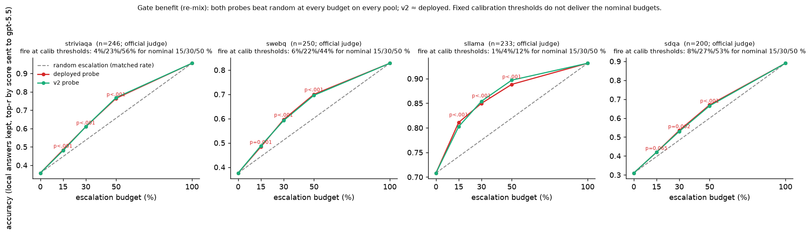

| 4-pool mean, official judge | @15 % | @30 % | @50 % |
|---|---|---|---|
| random escalation | .507 | .577 | .670 |
| deployed probe | .550 | .648 | .756 |
| v2 probe | .548 | .646 | .757 |
| layer-avg shrink-LDA ×3 | .552 | .649 | .758 |

Every probe beats random at every budget on every pool (p < .07 on SD-QA
@15 %, p ≤ .003 everywhere else). **The three probes are indistinguishable
at fixed budgets (±.005)**: the +.007–.011 AUC of the review-round variants
does not turn into accuracy. Under our own judge (pass-2 labels) the pattern
is identical (margins +.039 / +.069 / +.081).

Fire rates at the *calibration* thresholds, deployed probe, nominal
15/30/50 %: striviaqa 4/23/56, swebq 6/22/44, **sllama 1/4/12**, sdqa
7/27/53. The v2 probe's score distribution is different again
(striviaqa 25/46/65, sllama 4/8/19). Fixed global thresholds do not deliver
the budget; per-pool (or windowed) quantile thresholds — which by
construction produce the fixed-budget rows above — are the deployable fix,
matching the MiniCPM result (8bn/8bp).

### 9.3c Parity with the MiniCPM probe after the 8bl fix

A prior 8bl finding was a *serving-config* mismatch on MiniCPM (top_k 100 vs
official 20, force_listen 0 vs 3, a different system prompt). Fixing it moved
the local floor .371→.429, required re-dumping every feature set, and left
the probe weights valid but the thresholds not. Checklist for NVDA:

| item | MiniCPM (8bp, deployed) | NVDA (this doc) | parity |
|---|---|---|---|
| serving path | official pytorch demo config | NVIDIA NeMo `offline_voicechat`, library-default greedy text decoding (temperature 0, top_p 1; the streaming pipeline uses the same default) | ✔ |
| system prompt | official assistant prompt | our QA prompt ("do not greet") — the official default greets first | **ours; must be pinned for the streaming port** |
| dtype | official | bf16 on the speech stack (official fp32) → 15 % answer-text drift between passes, 1.3 % label flips | **ours; disclosed** |
| features | eot_last ‖ eot_mean8 ‖ user_mean @L22, 12,288-d | onset_last ‖ onset_mean8 ‖ user_mean @L30, 13,440-d | analogous (read point differs by design, §4.2) |
| scaler | none | `StandardScaler` (+.015–.023 on NVDA) | **differs — state it in the cross-family table** |
| C | grid {1e-4, 3e-4, 1e-3} by OOF → 3e-4 | 1e-4 (grid checked: 1e-4 best) | same rule, different winner |
| labels | gpt-5.4-mini judge on the model's transcript | same | ✔ |
| calibration rows | 5,228 (incl. expansion3 2,300 en + 400 zh) | 2,481 | **expansion3 source audio is not tracked** |
| thresholds | per-pool / windowed quantiles (8bn) | global OOF quantiles | **port needed** |

### 9.3d The causal re-capture (pass 3, 4×H100, `nvda_replay_v2.py`, `experiments4.py`)

All 3,500 calibration + external queries were replayed a third time with two
extra arrays per layer: `H_pre` (the 8 frames *before* the commit frame) and
`H_run` (mean over every frame before commit — the `user_mean` the streaming
readout actually computes). Same model, prompt, dtype, batching, commit rule.
Answer text drifted for 16 % of queries (bf16 batching, as before); the
commit frame moved for only 1.6 % (median shift 0 frames), so the read point
is stable across passes. Labels are pass-2.

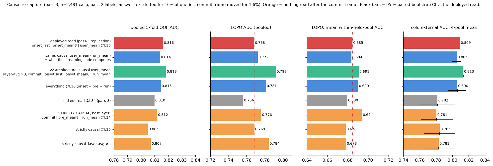

| read (all L2-logistic, C=1e-4, scaler) | OOF | LOPO | lopoM | ext mean | Δext vs deployed [95 % CI] |
|---|---|---|---|---|---|
| deployed read, pass-3 replication (onset_last ‖ onset_mean8 ‖ user_mean @L30) | .816 | .768 | .685 | .809 | reproduces pass 2 (.808) |
| same with the **causal user_mean** (`H_run`) — fixes the train/serve skew | .814 | .772 | .684 | .805 | −.004 [−.009, +.001] |
| v2 architecture with causal user_mean (layer-avg ×3, + commit frame) | .818 | .792 | .691 | .813 | +.004 [−.005, +.012] |
| everything @L30 (onset + pre + run) | .815 | .781 | .690 | .806 | −.003 |
| old eot read @L34, pass 3 | .810 | .756 | .680 | .782 | −.027 |
| **strictly causal**, best layer: commit ‖ pre_mean8 ‖ run_mean @L34 | .812 | .776 | .694 | .781 | −.029 [−.048, −.009] |
| strictly causal @L30 (commit ‖ pre_mean8 ‖ run_mean) | .805 | .769 | .678 | .785 | −.025 [−.044, −.006] |
| strictly causal @L22 / L26 / L38 | .80–.81 | .76–.77 | .66–.68 | .764–.779 | −.030 … −.046 |
| strictly causal, layer-avg ×3 | .807 | .784 | .678 | .783 | −.026 |

What this settles:

1. **The `user_mean` skew is harmless.** `cos(user_mean, run_mean)` at L30
   has median .996 (p10 .982); swapping in the causal version costs
   −.004 [−.009, +.001]. The streaming port can use `run_mean` directly and
   should be calibrated on it (pass-3 arrays already contain it).
2. **The fully causal gate costs ≈ .025–.03 external AUC**, consistently
   across layers and architectures (.78 vs .81). The pre-commit window
   (`H_pre`) is no better than the old end-of-audio window (`H_eot`): the
   extra signal in the deployed read comes from the model's first ~7 answer
   frames, not from anything before the commit. This is the number to put in
   the paper next to "the read lands 640 ms after the commit".
3. **The deployed recipe replicates on an independent capture** (.816 / .809
   vs .820 / .808), and the v2 gain replicates at the same small size
   (+.004 vs +.007 before).
4. The calibration-only metric `lopoM` again ranks a causal L34 read first
   (.694) although it transfers worst — within-calibration transfer does not
   predict external transfer at this resolution; pooled LOPO tracks external
   somewhat better (v2 .792 ↔ .813).

Files: `gate_pull/onset3/nvda_h3_*.L22-38.npz` (+ pass-3 answer jsonl),
`results_round4.json`, `make_fig_round4.py`. Full 14-layer shards are not
tracked because they occupy 12 GB.

### 9.4 What would move it further (all need the GPU)

1. **Causal re-capture**: store the pre-commit frames (ring buffer of the last
   8 PAD frames before commit + running mean over `[prompt_len, commit)`),
   which (a) fixes the `user_mean` skew, (b) gives a VAD-free replacement for
   `H_eot`, (c) enables trajectory features. ~3 GPU-h for 2,481 queries; no
   re-judging needed (labels flip 1.3 % between passes).
2. **Calibration expansion toward the external shape** — easy, open-ended
   factual/conversational queries the model tends to get right (calibration
   fail rate is .72; sllama's is .33 and it is the weakest pool). ~1,000
   rows ≈ 1.2 GPU-h + judging. Expected +.005–.01 external, concave curve.
3. **Report operating points, not only AUC**: precision/coverage per tier,
   external fire rates (§6.7), selective-risk curves including the 69
   no-commit rows, judge κ on identical transcripts, a fail-type breakdown,
   and the re-mix table redone with the current probe.
4. **Status 2026-09-01:** item 1 is DONE (§9.3d). Item 2 waits on the
   untracked expansion3 source audio and requires about 2.7 GPU-h.
